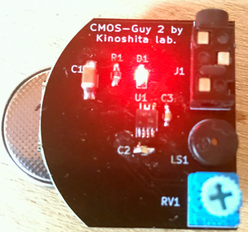
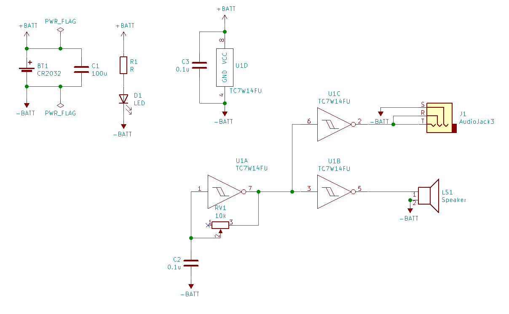

# CMOS野郎2
## 説明
CMOS野郎2は、シュミットトリガインバータ(TC7W14FU)を使った発振器と、スピーカーを組み合わせた、電池で動くシンプルな楽器です。
ステレオラインアウトもあります。

初代CMOS野郎(初代CMOS野郎
https://github.com/kinoshita-lab/cmos-guy )を基板化&小型化したものです。

## 基本的な使い方
- 電池を入れると動きます。**向きに気をつけてください。**使わない時は電池をはずしてください。
- あまり奥まで電池を入れると、抜くのが大変なので途中くらいにしておくとよいです。
- ツマミを回すと、ピッチが変わります。

## 応用的な使い方
- 回路がむき出しになっているので、あちこち触ってみると面白いです。
    - ツマミの裏辺りを触ると微妙にピッチが変わります。上手くやるとビブラートもできます。
    - スピーカーの穴を指でふさいだりすると、微妙にフィルターがかかります。
- 複数使うと、うなり(beat)が作れて面白いかもしれません。
- ミキサーに差すと、とりあえずPAつながってる？とかわかって便利かもしれません。

## 交換が必要な部品
電池は **CR2032** を使って下さい。

## 回路

